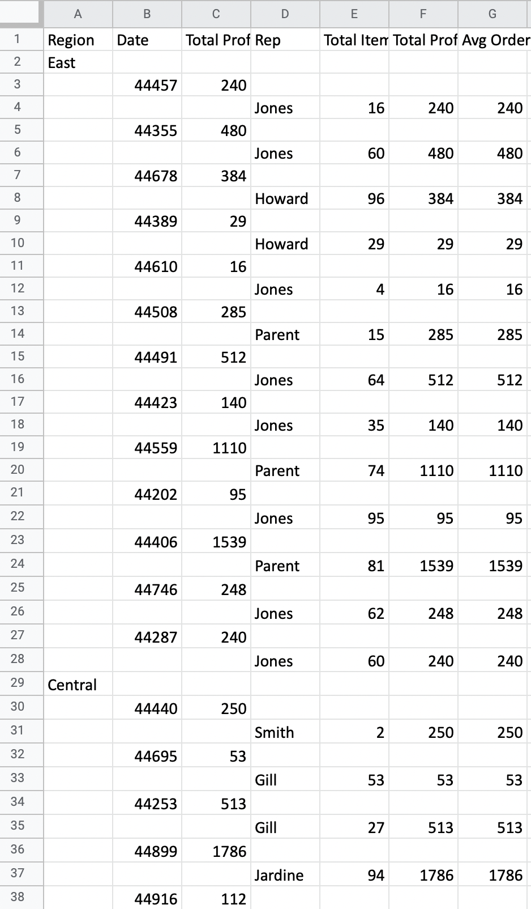
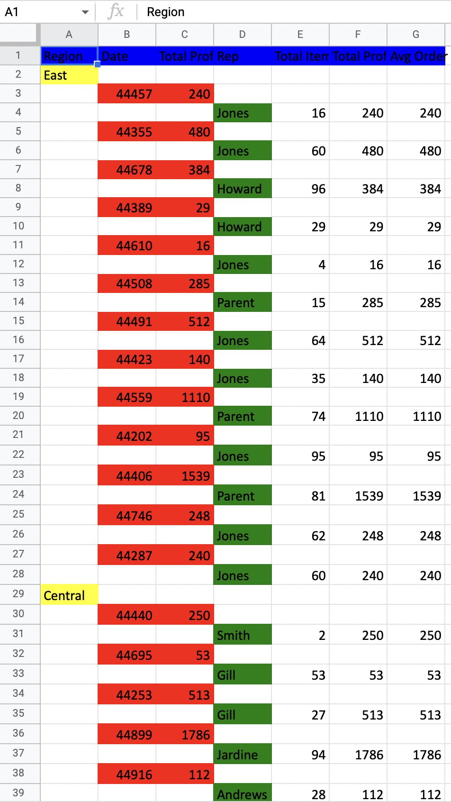

# Excel

To get started with Excel module, add the following dependency:

```scala
libraryDependencies += "@ORGANIZATION@" %% "scala-ql-excel" % "@VERSION@"
```

Excel module depends on [apache poi](https://poi.apache.org) for reading and writing documents.

Start by importing `scalaql`:

```scala mdoc
import scalaql._
import scalaql.sources.Naming
import scalaql.excel.{ExcelReadConfig, ExcelWriteConfig, CellResolutionStrategy}

// Docs classes
import scalaql.docs.ExcelData._

// Imports for examples
import java.nio.file.Paths
import java.time.LocalDate
```

## Reading file

Assume you have an Excel file like the following:

```scala mdoc
val ordersPath = Paths.get("docs/src/main/resources/orders_data.xlsx")
```

This specific Excel file has UpperCased headers. 
To read it, you should first specify `ExcelReadConfig`:

```scala mdoc
implicit val excelReadConfig: ExcelReadConfig = ExcelReadConfig.default.copy(
  naming = Naming.UpperCase,
  cellResolutionStrategy = CellResolutionStrategy.NameBased,
)
```

First, you defined a `Query` as usual:

```scala mdoc
val query = select[OrderInfo]
```

You can quickly view the file content:

```scala mdoc
query
  .show(truncate=false)
  .run(
    from(
      excel.read.file[OrderInfo](ordersPath)
    )
  )
```

## Writing file

A beautiful case is how it's now easy to generate an Excel report! 
Let's do some aggregations.  

Assume you would like to have the following report:

```scala mdoc
case class OrderReport(region: String, records: List[OrdersPerDate])

case class OrdersPerDate(
  date:               LocalDate,
  totalProfitPerDate: BigDecimal,
  records:            List[RepresentativeOrders])

case class RepresentativeOrders(
  rep:               String,
  totalItemsPerRep:  Int,
  totalProfitPerRep: BigDecimal,
  avgOrderPrice:     BigDecimal)
```

You could generate it with the following `Query`:

```scala mdoc
val reportAggregation: Query[From[OrderInfo], OrderReport] = select[OrderInfo]
  .groupBy(_.region)
  .aggregate { (region, orders) =>
    orders
      .report(_.orderDate, _.rep)((date, rep, orders) =>
        (
          orders.sumBy(_.units) &&
            orders.sumBy(order => order.unitCost * order.units) &&
            orders.avgBy(order => order.unitCost * order.units)
        ).map { case (totalItems, totalProfit, avgPrice) =>
          RepresentativeOrders(rep, totalItems, totalProfit, avgPrice)
        }
      )
      .combine((date, ordersPerRep) =>
        (
          ordersPerRep.sumBy(_.totalProfitPerRep) &&
            ordersPerRep.toList
        ).map { case (totalProfit, ordersList) =>
          OrdersPerDate(date, totalProfit, ordersList)
        }
      )
  }
  .map((OrderReport.apply _).tupled)
```

Before writing, we would specify the correct headers naming for the report:

```scala mdoc
implicit val excelWriteConfig: ExcelWriteConfig[OrderReport] = ExcelWriteConfig.default.copy(
  naming = Naming.WithSpacesCapitalize,
  writeHeaders = true
)
```

Then you could simply write it to an Excel file:

```scala mdoc
val excelReportPath = Paths.get("docs/target/orders_report.xlsx")
  
reportAggregation
  .foreach(
    excel.write.file[OrderReport](excelReportPath)
  )
  .run(
    from(
      excel.read.file[OrderInfo](ordersPath)
    )
  )
```

It will generate the following table:


## Document styling
You could also specify some styles for your document!

Start from the following imports:
```scala mdoc:reset
import scalaql._
import scalaql.excel._
import scalaql.sources.Naming
import scalaql.excel.{ExcelReadConfig, ExcelWriteConfig, CellResolutionStrategy}
import org.apache.poi.ss.usermodel.FillPatternType
import org.apache.poi.ss.usermodel.IndexedColors

// Docs classes
import scalaql.docs.ExcelData._

// Imports for examples
import java.nio.file.Paths
import java.time.LocalDate
```

Let's go to the report definition:
```scala mdoc
case class OrderReport(region: String, records: List[OrdersPerDate])

case class OrdersPerDate(
  date:               LocalDate,
  totalProfitPerDate: BigDecimal,
  records:            List[RepresentativeOrders])

case class RepresentativeOrders(
  rep:               String,
  totalItemsPerRep:  Int,
  totalProfitPerRep: BigDecimal,
  avgOrderPrice:     BigDecimal)
```

Then define document style for the report:

```scala mdoc
implicit val styling: ExcelStyling[OrderReport] = ExcelStyling
  .builder[OrderReport]
  .forAllHeaders(
    cellStyle
      .andThen(_.setFillPattern(FillPatternType.SOLID_FOREGROUND))
      .andThen(_.setFillForegroundColor(IndexedColors.BLUE.index))
  )
  .forField(
    _.region, 
    cellStyle
      .andThen(_.setFillPattern(FillPatternType.SOLID_FOREGROUND))
      .andThen(_.setFillForegroundColor(IndexedColors.YELLOW.index))
  )
  .forField(
    _.records.each.date, 
    cellStyle
      .andThen(_.setFillPattern(FillPatternType.SOLID_FOREGROUND))
      .andThen(_.setFillForegroundColor(IndexedColors.RED.index))
  )
  .forField(
    _.records.each.totalProfitPerDate, 
    cellStyle
      .andThen(_.setFillPattern(FillPatternType.SOLID_FOREGROUND))
      .andThen(_.setFillForegroundColor(IndexedColors.RED.index))
  )
  .forField(
    _.records.each.records.each.rep, 
    cellStyle
      .andThen(_.setFillPattern(FillPatternType.SOLID_FOREGROUND))
      .andThen(_.setFillForegroundColor(IndexedColors.GREEN.index))
  )
  .build
```

Write a query:

```scala mdoc
val reportAggregation: Query[From[OrderInfo], OrderReport] = select[OrderInfo]
  .groupBy(_.region)
  .aggregate { (region, orders) =>
    orders
      .report(_.orderDate, _.rep)((date, rep, orders) =>
        (
          orders.sumBy(_.units) &&
            orders.sumBy(order => order.unitCost * order.units) &&
            orders.avgBy(order => order.unitCost * order.units)
        ).map { case (totalItems, totalProfit, avgPrice) =>
          RepresentativeOrders(rep, totalItems, totalProfit, avgPrice)
        }
      )
      .combine((date, ordersPerRep) =>
        (
          ordersPerRep.sumBy(_.totalProfitPerRep) &&
            ordersPerRep.toList
        ).map { case (totalProfit, ordersList) =>
          OrdersPerDate(date, totalProfit, ordersList)
        }
      )
  }
  .map((OrderReport.apply _).tupled)
```
Specify `ExcelReadConfig`:

```scala mdoc
implicit val excelReadConfig: ExcelReadConfig = ExcelReadConfig.default.copy(
  naming = Naming.UpperCase,
  cellResolutionStrategy = CellResolutionStrategy.NameBased,
)
```

Then write the file as usual:

```scala mdoc
implicit val excelStyledWriteConfig: ExcelWriteConfig[OrderReport] = ExcelWriteConfig.default.copy(
  naming = Naming.WithSpacesCapitalize,
  writeHeaders = true
)

val ordersPath = Paths.get("docs/src/main/resources/orders_data.xlsx")
val excelStyledReportPath = Paths.get("docs/target/orders_styled_report.xlsx")

reportAggregation
  .foreach(
    excel.write.file[OrderReport](excelStyledReportPath)
  )
  .run(
    from(
      excel.read.file[OrderInfo](ordersPath)
    )
  )
```

It will produce a more fancy Excel document

