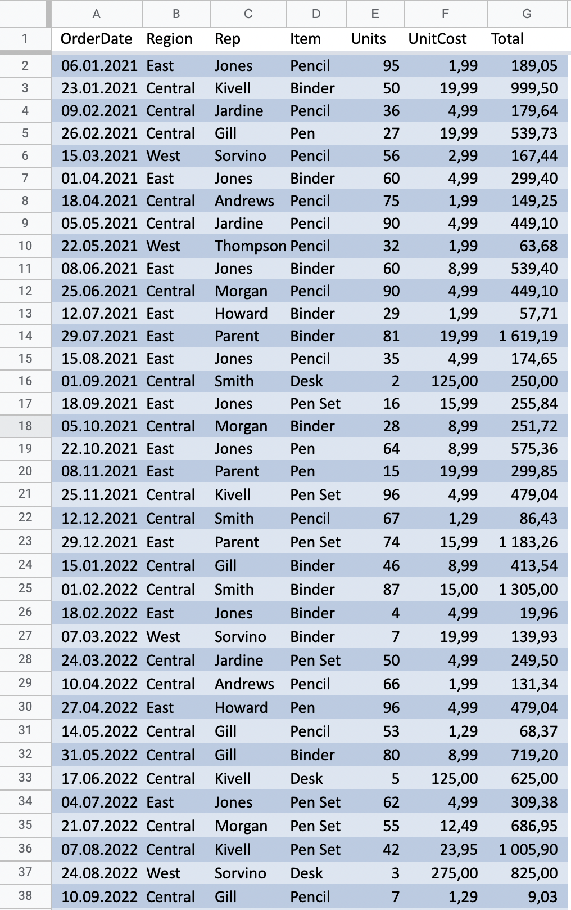

# Reading Excel files

<head>
  <meta charset="UTF-8" />
  <meta name="author" content="Vitalii Honta" />
  <meta name="description" content="Getting started with Scala QL Excel module. Reading Excel files" />
  <meta name="keywords" content="scala-ql, scala-ql-excel, scala process excel files, scala-ql read excel, scala read excel" />
</head>

## Reading document

Start by importing `scalaql`:

```scala mdoc
import scalaql._
import scalaql.excel.CellResolutionStrategy

// Docs classes
import scalaql.docs.ExcelData._

// Imports for examples
import java.nio.file.Paths
import java.time.LocalDate
```

Assume you have an Excel file like the following:

```scala mdoc
val ordersPath = Paths.get("docs/src/main/resources/orders_data.xlsx")
```

Which looks like:



To read it, you should first specify `ExcelReadConfig`:

First, you defined a `Query` as usual:

```scala mdoc
val query = select[OrderInfo]
```

Then you can quickly view the file content.  
**NOTE:** This specific Excel file has UpperCased headers.

```scala mdoc
query
  .show(truncate=false)
  .run(
    from(
      excel
        .read[OrderInfo]
        .option(Naming.Capitalize)
        .option(CellResolutionStrategy.NameBased)
        .file(ordersPath)
    )
  )
```