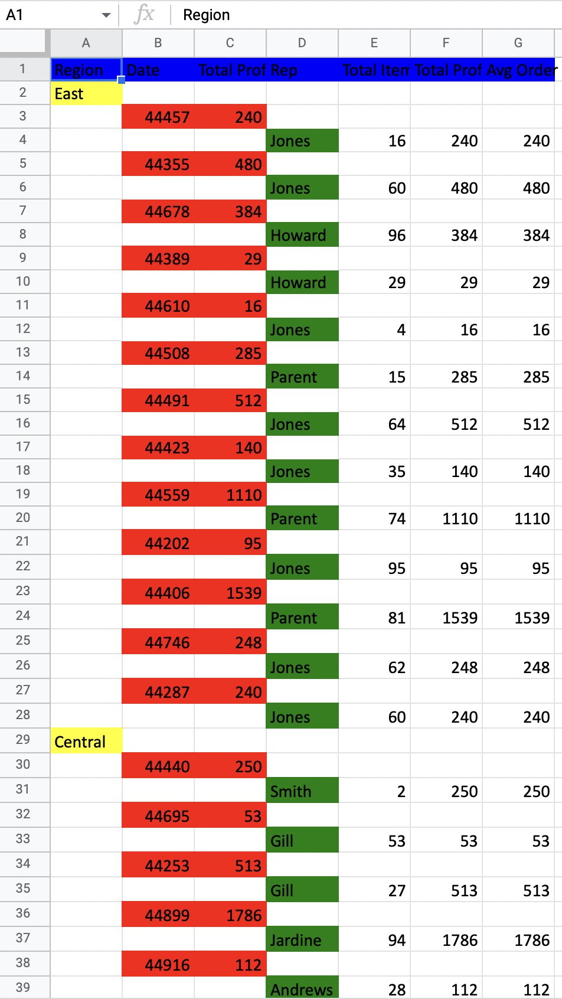

# Styling Excel document

You could also specify some styles for your document.  
Start by importing `scalaql`:

```scala mdoc
import scalaql._
import scalaql.excel._
import scalaql.sources.Naming
import org.apache.poi.ss.usermodel.FillPatternType
import org.apache.poi.ss.usermodel.IndexedColors

// Docs classes
import scalaql.docs.ExcelData._

// Imports for examples
import java.nio.file.Paths
import java.time.LocalDate
```

Let's go to the report definition:

```scala mdoc
case class OrderReport(region: String, records: List[OrdersPerDate])

case class OrdersPerDate(
  date:               LocalDate,
  totalProfitPerDate: BigDecimal,
  records:            List[RepresentativeOrders])

case class RepresentativeOrders(
  rep:               String,
  totalItemsPerRep:  Int,
  totalProfitPerRep: BigDecimal,
  avgOrderPrice:     BigDecimal)
```

Then define document style for the report:

```scala mdoc
val orderReportStyling: ExcelStyling[OrderReport] = ExcelStyling
  .builder[OrderReport]
  .forAllHeaders(
    cellStyle
      .andThen(_.setFillPattern(FillPatternType.SOLID_FOREGROUND))
      .andThen(_.setFillForegroundColor(IndexedColors.BLUE.index))
  )
  .forField(
    _.region, 
    cellStyle
      .andThen(_.setFillPattern(FillPatternType.SOLID_FOREGROUND))
      .andThen(_.setFillForegroundColor(IndexedColors.YELLOW.index))
  )
  .forField(
    _.records.each.date, 
    cellStyle
      .andThen(_.setFillPattern(FillPatternType.SOLID_FOREGROUND))
      .andThen(_.setFillForegroundColor(IndexedColors.RED.index))
  )
  .forField(
    _.records.each.totalProfitPerDate, 
    cellStyle
      .andThen(_.setFillPattern(FillPatternType.SOLID_FOREGROUND))
      .andThen(_.setFillForegroundColor(IndexedColors.RED.index))
  )
  .forField(
    _.records.each.records.each.rep, 
    cellStyle
      .andThen(_.setFillPattern(FillPatternType.SOLID_FOREGROUND))
      .andThen(_.setFillForegroundColor(IndexedColors.GREEN.index))
  )
  .build
```

Write a query:

```scala mdoc
val reportAggregation: Query[From[OrderInfo], OrderReport] = select[OrderInfo]
  .groupBy(_.region)
  .aggregate { (region, orders) =>
    orders
      .report(_.orderDate, _.rep)((date, rep, orders) =>
        (
          orders.sumBy(_.units) &&
            orders.sumBy(order => order.unitCost * order.units) &&
            orders.avgBy(order => order.unitCost * order.units)
        ).map { case (totalItems, totalProfit, avgPrice) =>
          RepresentativeOrders(rep, totalItems, totalProfit, avgPrice)
        }
      )
      .combine((date, ordersPerRep) =>
        (
          ordersPerRep.sumBy(_.totalProfitPerRep) &&
            ordersPerRep.toList
        ).map { case (totalProfit, ordersList) =>
          OrdersPerDate(date, totalProfit, ordersList)
        }
      )
  }
  .map((OrderReport.apply _).tupled)
```

Then write the file as usual:

```scala mdoc
val ordersPath = Paths.get("docs/src/main/resources/orders_data.xlsx")
val excelStyledReportPath = Paths.get("docs/target/orders_styled_report.xlsx")

reportAggregation
  .foreach(
    excel
      .write[OrderReport]
      // Notice styling option
      .option(orderReportStyling)
      // Other options
      .option(Naming.WithSpacesCapitalize)
      .option(headers = true)
      .file(excelStyledReportPath)
  )
  .run(
    from(
      excel
        .read[OrderInfo]
        .option(Naming.UpperCase)
        .option(CellResolutionStrategy.NameBased)
        .file(ordersPath)
    )
  )
```

It will produce a more fancy Excel document

