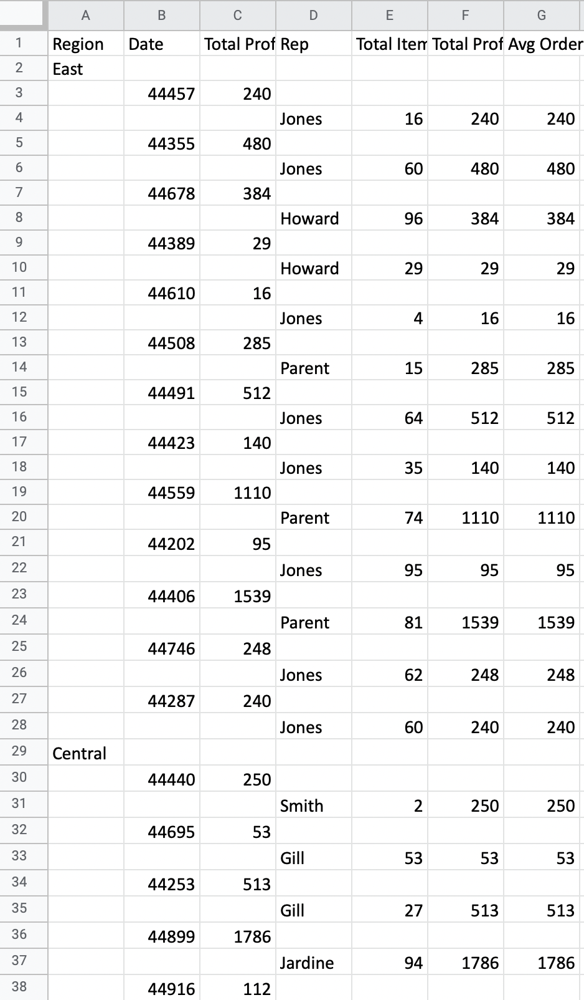

# Writing Excel files

<head>
  <meta charset="UTF-8" />
  <meta name="author" content="Vitalii Honta" />
  <meta name="description" content="Getting started with Scala QL Excel module. Writing Excel files" />
  <meta name="keywords" content="scala-ql, scala-ql-excel, scala process excel files, scala-ql write excel file, scala-ql generate excel file" />
</head>

Start by importing `scalaql`:

```scala mdoc
import scalaql._
import scalaql.excel.CellResolutionStrategy

// Docs classes
import scalaql.docs.ExcelData._

// Imports for examples
import java.nio.file.Paths
import java.time.LocalDate
```

A beautiful case is how it's now easy to generate an Excel report!
Let's do some aggregations.

Assume you would like to have the following report:

```scala mdoc
case class OrderReport(region: String, records: List[OrdersPerDate])

case class OrdersPerDate(
  date:               LocalDate,
  totalProfitPerDate: BigDecimal,
  records:            List[RepresentativeOrders])

case class RepresentativeOrders(
  rep:               String,
  totalItemsPerRep:  Int,
  totalProfitPerRep: BigDecimal,
  avgOrderPrice:     BigDecimal)
```

You could generate it with the following `Query`:

```scala mdoc
val reportAggregation: Query[From[OrderInfo], OrderReport] = select[OrderInfo]
  .groupBy(_.region)
  .aggregate { (region, orders) =>
    orders
      .report(_.orderDate, _.rep)((date, rep, orders) =>
        (
          orders.sumBy(_.units) &&
            orders.sumBy(order => order.unitCost * order.units) &&
            orders.avgBy(order => order.unitCost * order.units)
        ).map { case (totalItems, totalProfit, avgPrice) =>
          RepresentativeOrders(rep, totalItems, totalProfit, avgPrice)
        }
      )
      .combine((date, ordersPerRep) =>
        (
          ordersPerRep.sumBy(_.totalProfitPerRep) &&
            ordersPerRep.toList
        ).map { case (totalProfit, ordersList) =>
          OrdersPerDate(date, totalProfit, ordersList)
        }
      )
      .map(ordersPerDate => OrderReport(region, ordersPerDate))
  }
```

Then you could simply write it to an Excel file:  
**NOTE:** The Excel file used for this example has UpperCased headers.  
**NOTE 2:** Before writing, we would specify the correct headers naming for the report:

```scala mdoc
val ordersPath = Paths.get("docs/src/main/resources/orders_data.xlsx")
val excelReportPath = Paths.get("docs/target/orders_report.xlsx")
  
reportAggregation
  .foreach(
    excel
      .write[OrderReport]
      .option(Naming.WithSpacesCapitalize)
      .option(headers = true)
      .file(excelReportPath)
  )
  .run(
    from(
      excel
        .read[OrderInfo]
        .option(Naming.UpperCase)
        .option(CellResolutionStrategy.NameBased)
        .file(ordersPath)
    )
  )
```

It will generate the following table:
