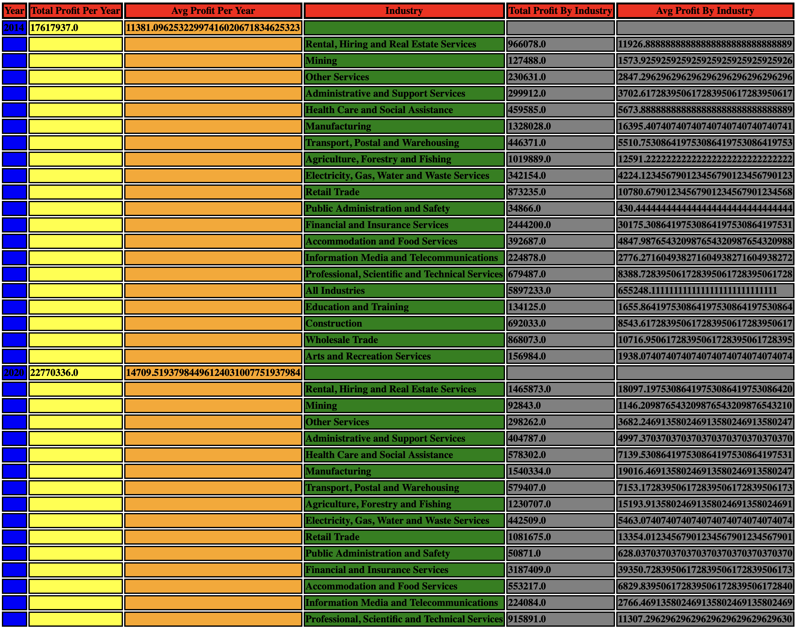

# Styling HTML documents

Scala QL allows to customize the resulting HTML document with CSS styles.

Start by importing `scalaql`:

```scala mdoc
import scalaql._
import scalaql.html.HtmlStyling
import scalatags.Text.styles._
import scalatags.Text.implicits._

// Docs classes
import scalaql.docs.DocUtils._

// Imports for examples
import java.nio.file.Paths
```

We'll use the following CSV dataset:

```scala mdoc
import scalaql.docs.CsvData._

val dir = Paths.get("docs/src/main/resources/annual-enterprise-survey-2020/")

val csvInput =         
  csv
   .read[EnterpriseSurvey]
   // In this case it's required to provide correct naming.
   .option(Naming.SnakeCase)
   .directory(dir, globPattern = "**/*.csv")
```

And then generate the following report:

```scala mdoc

case class ByIndustry(
  industry:              String,
  totalProfitByIndustry: BigDecimal,
  avgProfitByIndustry:   BigDecimal)

case class ByYear(
  year:               Int,
  totalProfitPerYear: BigDecimal,
  avgProfitPerYear:   BigDecimal,
  byIndustry:         List[ByIndustry])

val reportData: Query[From[EnterpriseSurvey], ByYear] =
  select[EnterpriseSurvey]
    .groupBy(_.year)
    .aggregate { (year, data) =>
      val byIndustry = data.report(_.industryNameAnzsic) { (industry, data) =>
         (
          data.sumBy(_.decimalValue) &&
          data.avgBy(_.decimalValue)
        ).map { case (total, avg) => ByIndustry(industry, total, avg) }
      }
       
      (
        data.sumBy(_.decimalValue) &&
        data.avgBy(_.decimalValue) &&
        byIndustry
      ).map { case (total, avg, byIndustry) =>
        ByYear(year, total, avg, byIndustry)
      }
    }
```

To specify CSS styles for your report, use `HtmlStyling` builder:

```scala mdoc
val reportStyle = HtmlStyling.builder[ByYear]
  .forAllHeaders(List(backgroundColor := "red", border := "3px solid #000"))
  .forField(
    _.year,
    List(
      backgroundColor := "blue",
      fontWeight.bold,
      verticalAlign.top,
      textAlign.left,
      border := "2px solid #000"
    )
  )
  .forField(
    _.totalProfitPerYear,
    List(
      backgroundColor := "yellow",
      fontWeight.bold,
      verticalAlign.top,
      textAlign.left,
      border := "2px solid #000"
    )
  )
  .forField(
    _.avgProfitPerYear,
    List(
      backgroundColor := "orange",
      fontWeight.bold,
      verticalAlign.top,
      textAlign.left,
      border := "2px solid #000"
    )
  )
  .forField(
    _.byIndustry.each.industry,
    List(
      backgroundColor := "green",
      fontWeight.bold,
      verticalAlign.top,
      textAlign.left,
      border := "2px solid #000"
    )
  )
  .forField(
    _.byIndustry.each.totalProfitByIndustry,
    List(
      backgroundColor := "gray",
      fontWeight.bold,
      verticalAlign.top,
      textAlign.left,
      border := "2px solid #000"
    )
  )
  .forField(
    _.byIndustry.each.avgProfitByIndustry,
    List(
      backgroundColor := "gray",
      fontWeight.bold,
      verticalAlign.top,
      textAlign.left,
      border := "2px solid #000"
    )
  )
  .withDefaultForFields(
    List(verticalAlign.top, textAlign.left, border := "2px solid #000")
  )
  .build
```

This is how it could be written as HTML file:

```scala mdoc
reportData
  .foreach(
    html
      .write[ByYear]
      .option(Naming.WithSpacesCapitalize)
      .option(reportStyle)
      .file(Paths.get("docs/target/report-styled.html"))
  )
  .run(
    from(csvInput)
  )
```

It will produce a more fancy report:  
